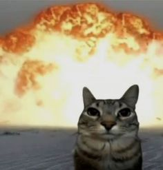

#Clase 01

# 10 cualidades
- Tengo el pelo rojo
- Ansiosa
- Amable
- Fuerte (fisicamente)
- Me gusta el maquillaje
- Tengo un perro viejito
- Tengo un conejo 
- Soy fumadora
- Tengo problemas de atención
  
#La tercera mesa - Graham Harman
- La tercera mesa se aleja de lo funcional → se vuelve más conceptual
- Menos interés en representar una mesa “real” → más en la idea de mesa
- Objetos o elementos más abstractos / simbólicos
- Puede cuestionar el rol del objeto (¿soporte, escenario, concepto?)
 - Reflexión sobre la representación (no es una mesa, es la idea de mesa)

# Mi primera imagen

